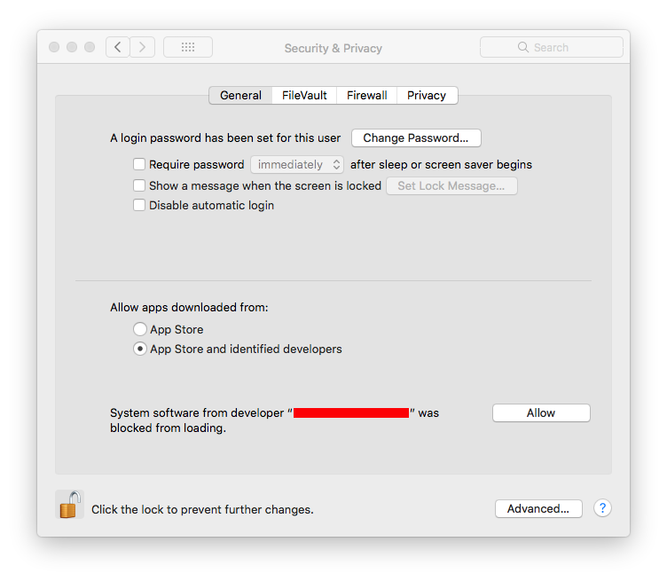

# README

<!-- START doctoc generated TOC please keep comment here to allow auto update -->
<!-- DON'T EDIT THIS SECTION, INSTEAD RE-RUN doctoc TO UPDATE -->
**Table of Contents**  *generated with [DocToc](https://github.com/thlorenz/doctoc)*

- [1 - Bootstrap](#1---bootstrap)
- [2 - Fix MacOS Kext isste](#2---fix-macos-kext-isste)
- [3 - Finalize](#3---finalize)
- [4 - Start the VM](#4---start-the-vm)

<!-- END doctoc generated TOC please keep comment here to allow auto update -->


## 1 - Bootstrap

Run the bootstrap script
```
scripts/install.sh
```

## 2 - Fix MacOS Kext issue

Run this script after you attempt to install virtualbox. Keep approving the kexts until the script runs cleanly:

```
scripts/vbox-kext.sh
```




## 3 - Finalize

```
scripts/install-force.sh
```


## 4 - Start the VM


```
vagrant up
```
